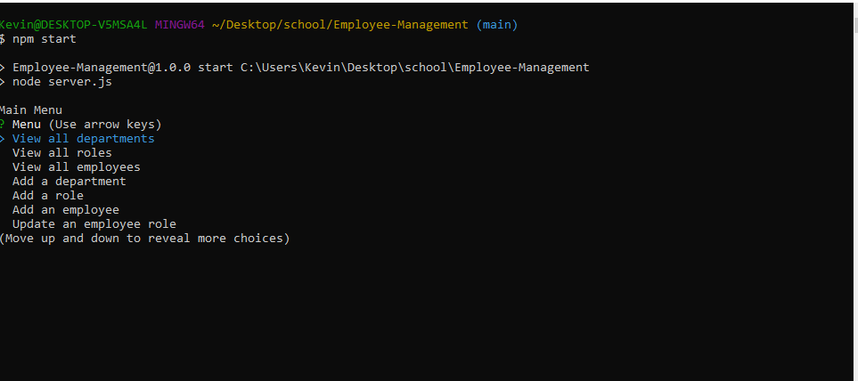
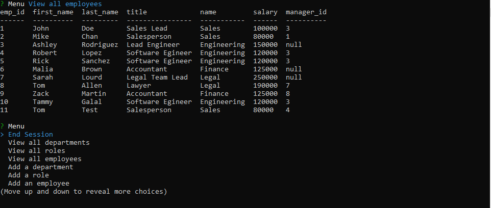

# Employee-Management

- Built for keeping track of Employees in a company as well updating new employees and their roles as well as their departments.
- Used JavaScript, Node, mysql, mysql-promise.

## Video Demo
https://drive.google.com/file/d/1bzxdgv-U9_vJATE8oSDNOrlqhO2RVfz9/view

## Showcase

## Github Repo Link
https://github.com/KevinTulakyan/Employee-Management